# 下载和安装Hopper

> #### danger:: 请支持正版
> 警告⚠️：此处Hopper破解版仅限于技术研究使用，**不准**用于**非法目的**，否则后果自负。
> 
> 如有侵权，请联系笔者删除。

## 下载
下载破解版的Hopper Disassembler：

[hopper disassembler for mac v4破解版下载(免授权文件/序列号) v4.0.8 - 软件学堂](http://www.xue51.com/mac/6040.html#xzdz)

-> 得到：[hopperdisassembler_6040.dmg](http://soft.down9.xyz/hopperdisassembler_6040.dmg)

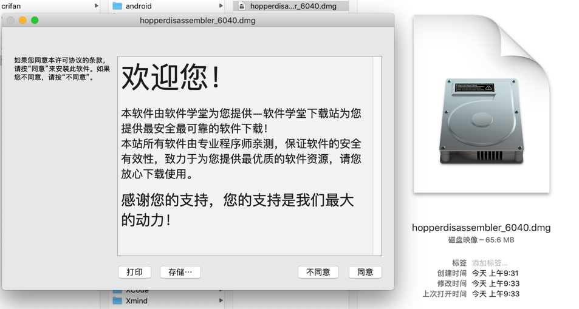

## 安装

双击`dmg`，继续，进入界面：

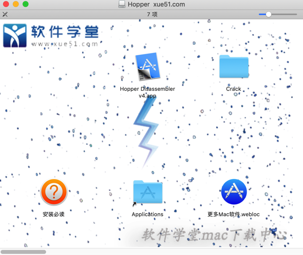

* 注：不要参考教程中说的，双击，否则会直接运行的。

去把`Hopper Disassembler v4.app`拖动到`应用程序`中：

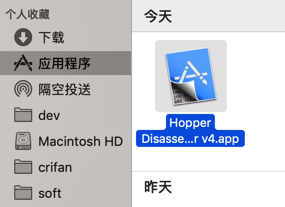

另外`Crack`中有个：`HopperV4Patcher.app`

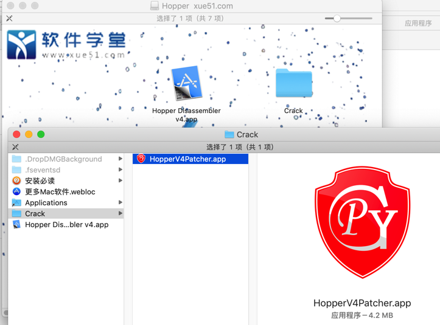

双击运行，出现提示：

* 不明身份开发者
  * 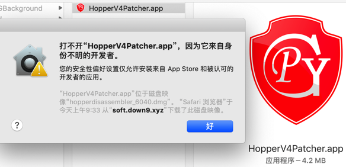

去隐私中允许：

* 仍要打开
  * 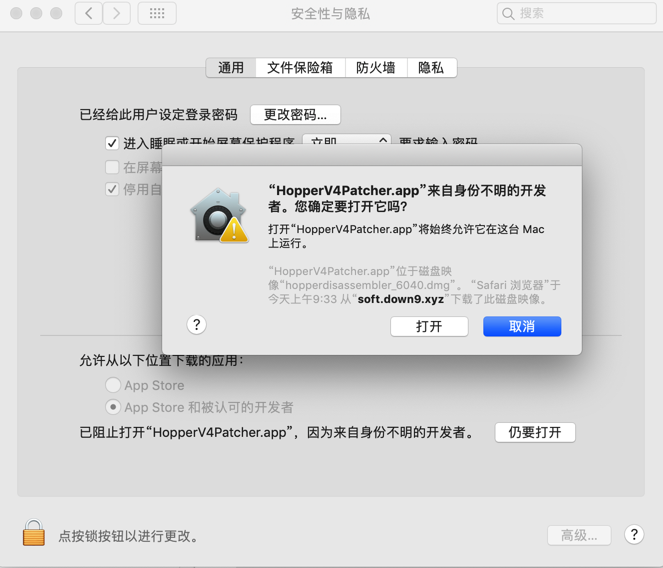

即可出现界面：

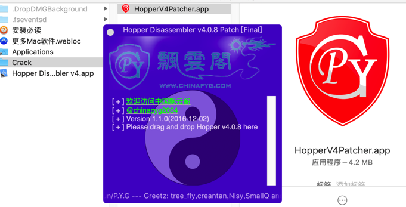

再去把应用程序中的：`Hopper Disassembler v4.app`拖动到这个patch界面中：

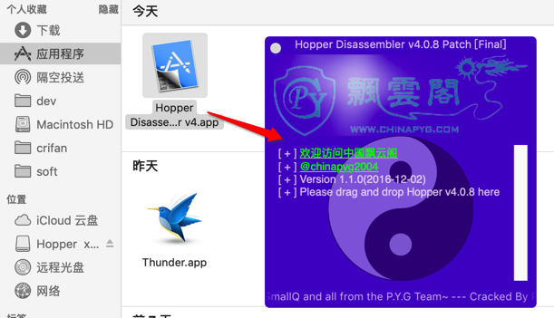

瞬间就破解好了：

* 显示`patch success`
  * 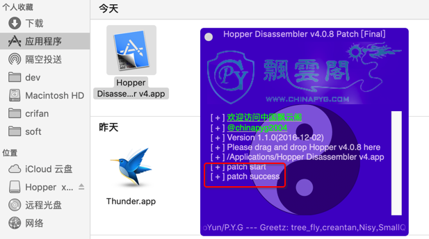

如此，即可安装完毕，即可正常打开，已破解的Hopper：

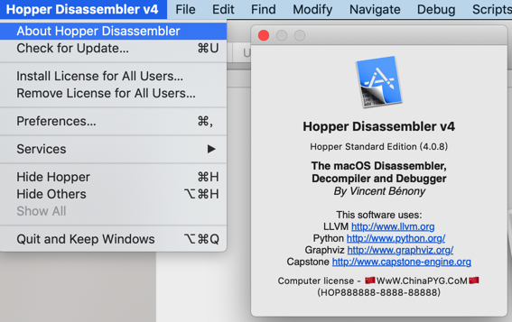

的确没有注册弹框，可以看到`Computer license`了，说明破解成功。

另外：为了防止更新导致破解失效，去看看更新设置：

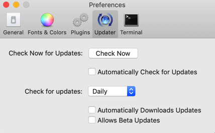

此处已经是关闭自动升级更新了，是我们希望的：不要开启自动更新。

后记：

结果用了几天后，还是会过期，无法继续使用：

```bash
Demo period has expired
Document will be closed
```

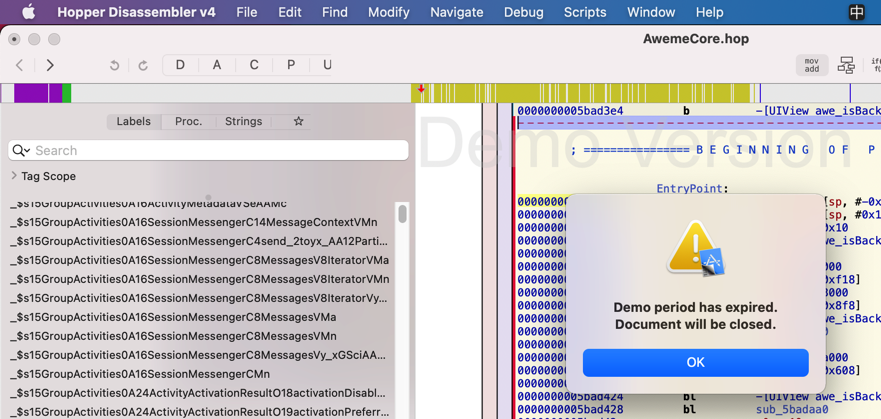

点击OK，就退出了。

另外，此处感觉Hopper也比较卡顿，且对于大型app也会卡死，所以放弃。

继续转用[IDA](https://book.crifan.org/books/reverse_tool_ida/website/)吧。
