# Hopper使用举例：AwemeCore

## Hopper加载AwemeCore

* 输入文件：`AwemeCore`

然后把`AwemeCore`拖进`Hopper`

出现Loader弹框：

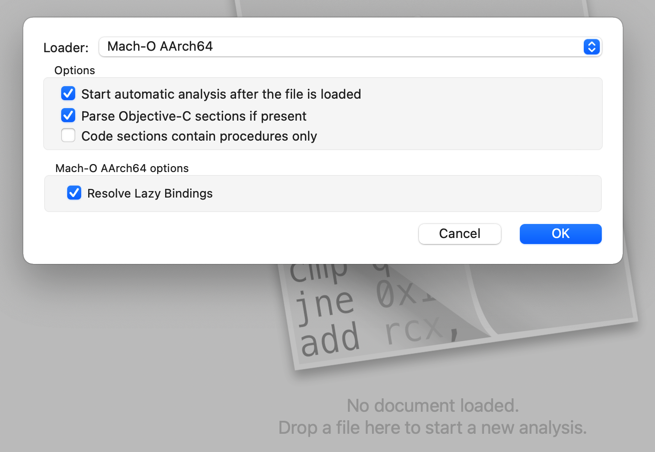

然后开始加载和分析：

* Loading Mach-O AArch64 file
  * Processing bindings
    * 
  * Reading Objective-C
    * Reading Objective-C super refs
      * 
    * Reading Objective-C class list
      * 

加载完毕，进入主页面：

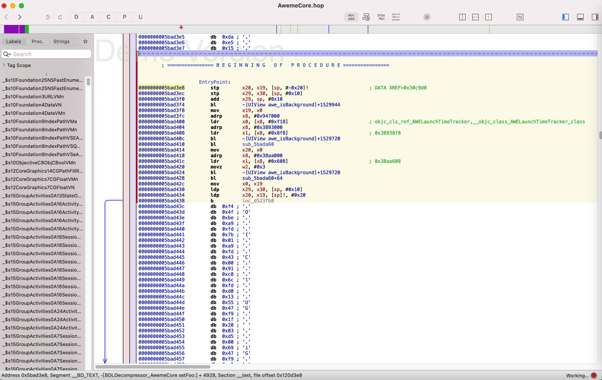

缺点：目前总体有点卡顿

### 分析代码逻辑

接下来，就是如何具体分析逻辑了

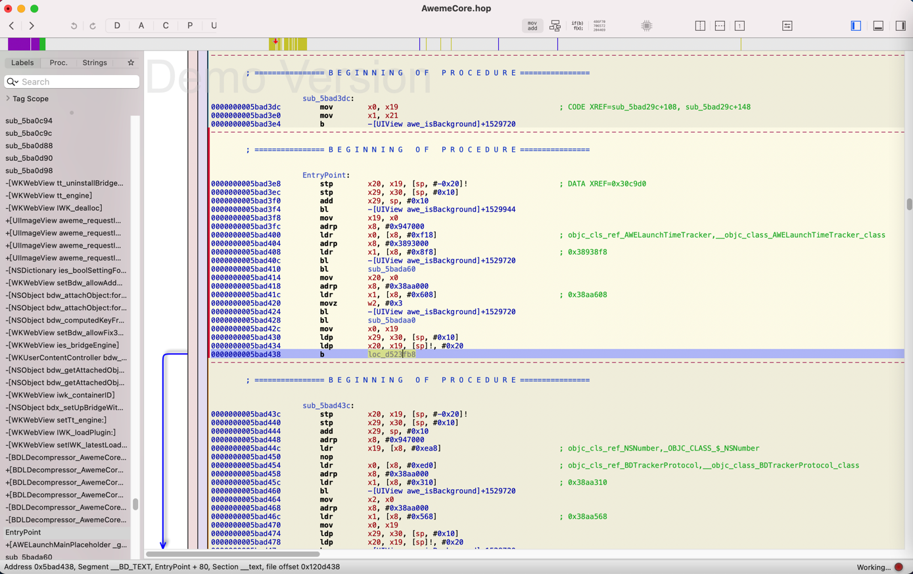

此处可以看到函数名：`awe_isBackground`

双击后，跳转到函数实现：

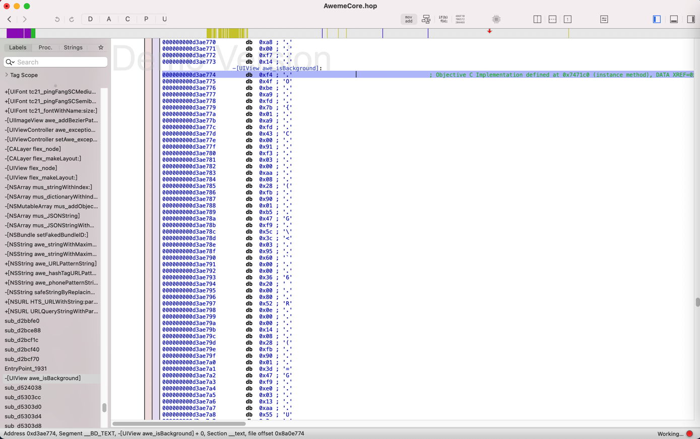

点击 尝试别人说的，切换到 伪代码 ObjC的

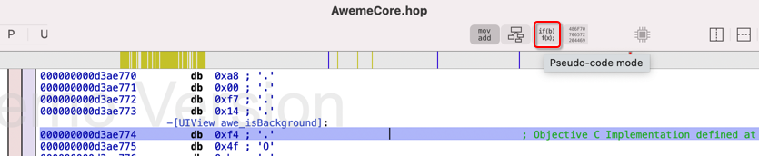

此处出现警告：

* No procedure at this address
  * 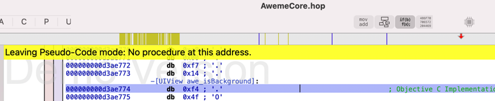

继续去找其他逻辑：比如，是否有越狱相关内容。

从左边的函数列表：

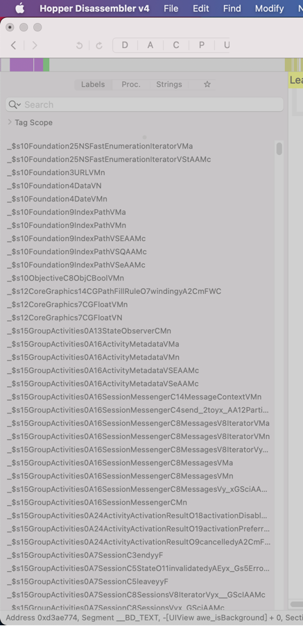

找找哪些和 启动相关的、初始化相关的

比如之前看到的，靠近entry的`AWELaunchMainPlaceholder`这种函数：

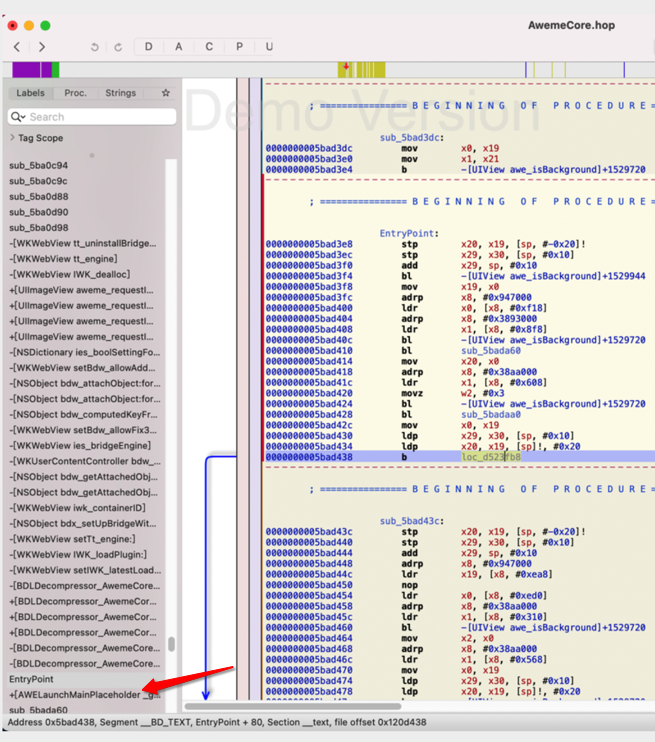

就很值得好好研究看看

另外继续研究越狱相关：

继续研究左边函数列表：

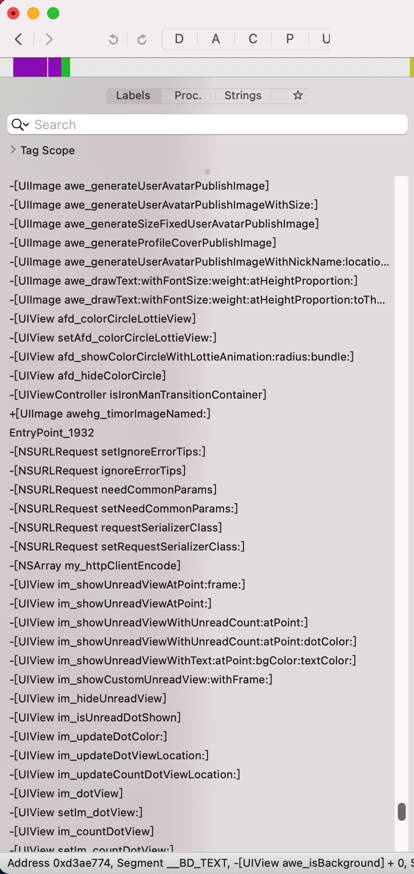

去试试，搜索`Find`->`Find`

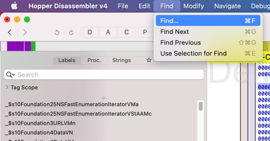

越狱：`jailbreak`

* 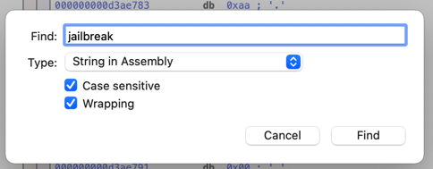
  * 看看Type还有哪些类型
    * 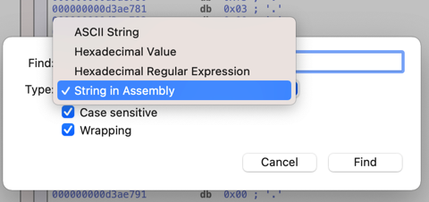
  * 此处为了模糊搜索更多内容，所以取消勾选：`Case sensitive`
    * 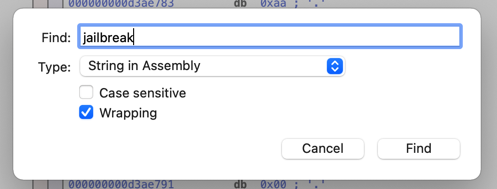

开始搜索：

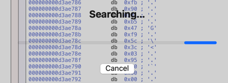

此处搜索了很多分钟，仍没有结束。

后来是，等待了2天多，依旧没结束，所以放弃。

尝试点击Cancel时，已无法点击。

索性强制退出：

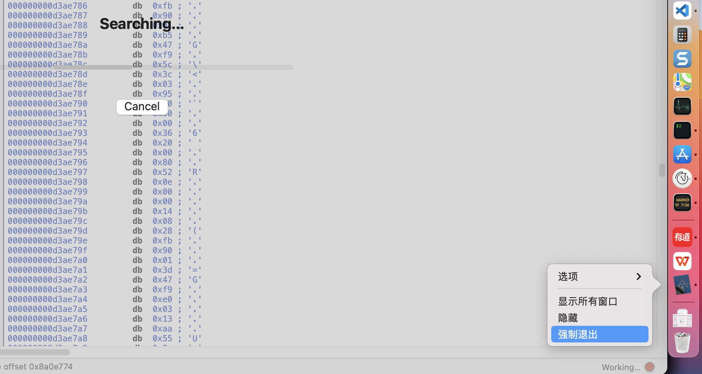

->

* 目前的结论
  * Hopper对于（包含逻辑和内容很多的）大的二进制，基本上无法正常使用。
