# Hopper分析Thunder逻辑

对于`Thunder迅雷`的基本界面：

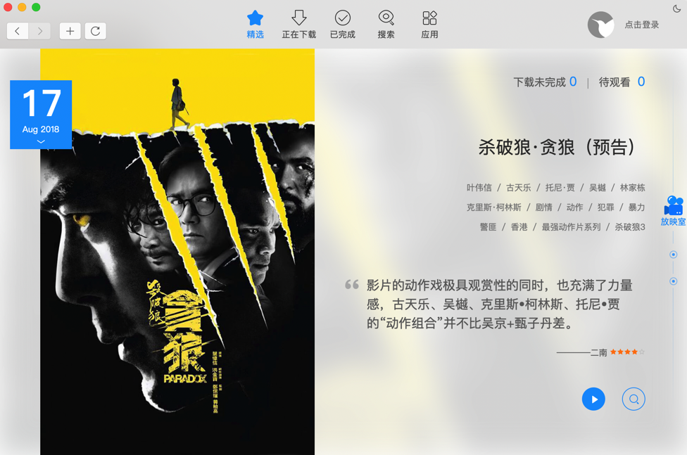

想要去研究其中对应的`精选`、`搜索`、`应用`之类的内容。

去搜：

`search`

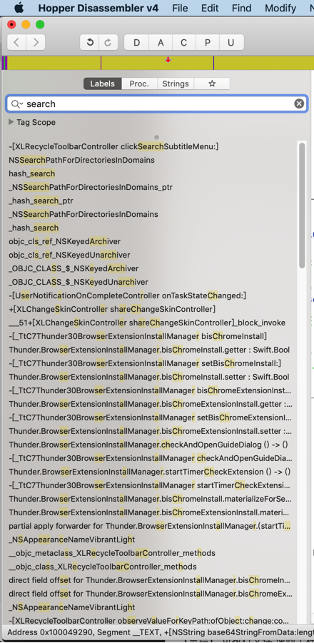

第一个，看起来就是我们希望的要找的

`-[XLRecycleToolbarController clickSearchSubtitleMenu:]:`

点击`搜索`子菜单

-》那顶部的5个：

精选 正在下载 已完成 搜索 应用

就应该叫做 主菜单了

看了看代码：

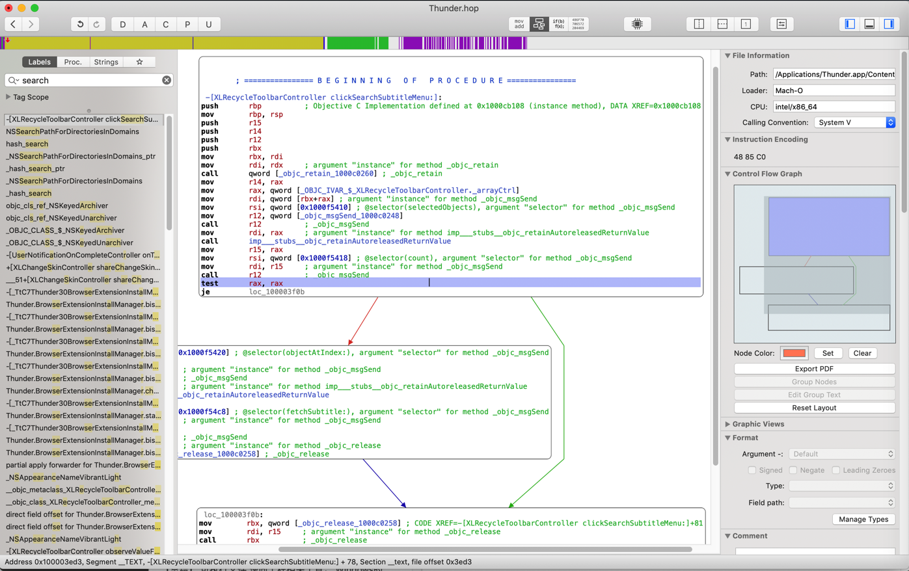

也看不出什么头绪

十秒逆向九秒猜

再去找 精选

但是不知道英文如何翻译 精选 才能找到

不过想到了，去找类似的 

`SubtitleMenu`

或

`XLRecycleToolbarController click`

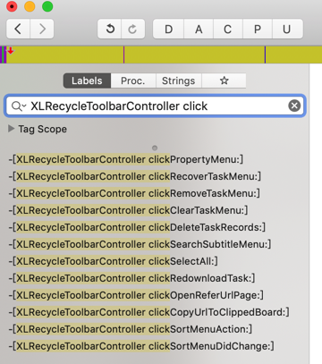

只有其他的一些 但不是我们要的

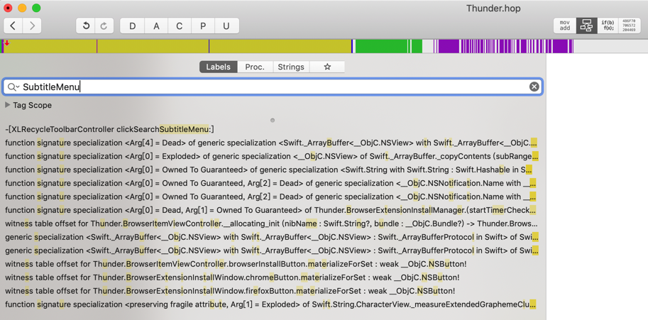

也没有我们要的

搜：`jingxuan`，也没有。

再去找找其他的：`application`

找到：

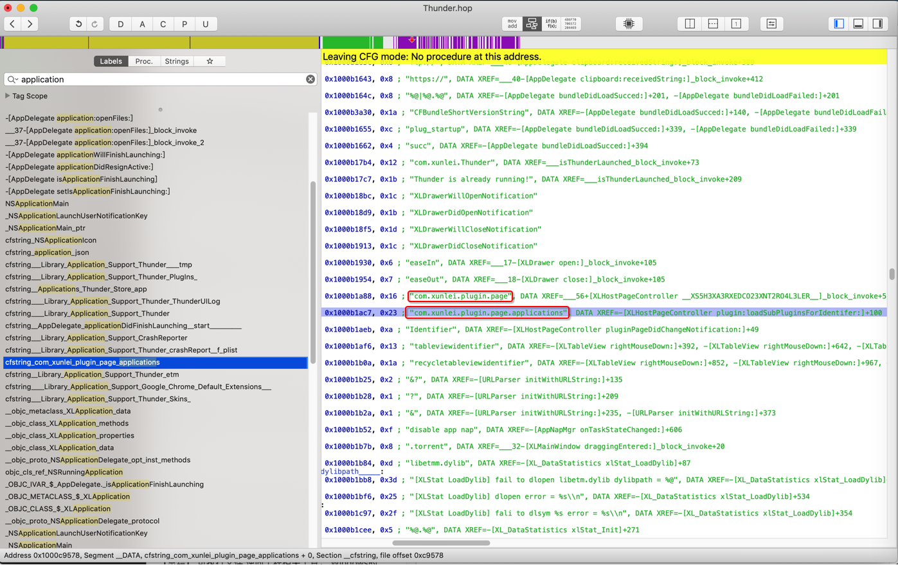

```c
00000001000c9558        dq        ___CFConstantStringClassReference, 0x7c8, 0x1000b1a88, 0x16 ; "com.xunlei.plugin.page", DATA XREF=___56+[XLHostPageController __XS5H3XA3RXEDCO23XNT2RO4L3LER__]_block_invoke+55
                     cfstring_com_xunlei_plugin_page_applications:
00000001000c9578        dq        ___CFConstantStringClassReference, 0x7c8, 0x1000b1ac7, 0x23 ; "com.xunlei.plugin.page.applications", DATA XREF=-[XLHostPageController plugin:loadSubPluginsForIdentifer:]+100
                     cfstring_Identifier:
```

-》或许还有其他的

`com.xunlei.plugin.page.xxx`

?

`labels`中没找到 

不过发现strings中有一些：

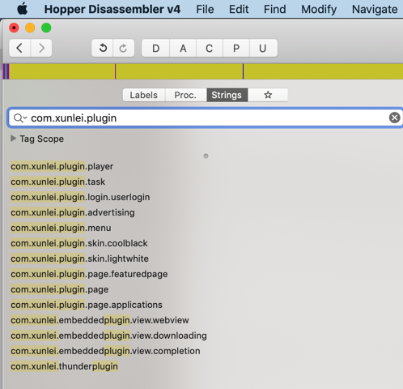

不过其中的：

```c
00000001000ab6a4        db        "com.xunlei.embeddedplugin.view.webview", 0 ; DATA XREF=cfstring_com_xunlei_embeddedplugin_view_webview
```

反推，倒是很可能是此处的：`精选`

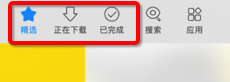

表示用webview 显示 精选内容

那再去搜搜：

* `com.xunlei.embeddedplugin.view`
* `com.xunlei.embeddedplugin`

没有找到其他的

顺带看到一个 `Tag Scope`

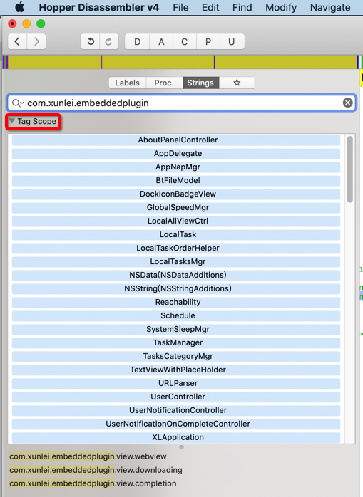

是一个：好像是 内部的类 方法 函数 的列表

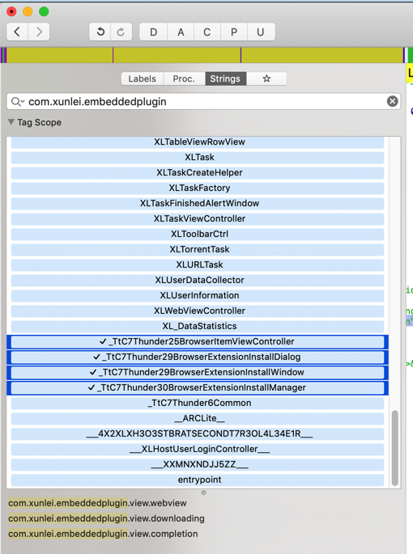

另外顺带看看：

* `Proc`=`Procedure`=`进程`=`函数`
  * 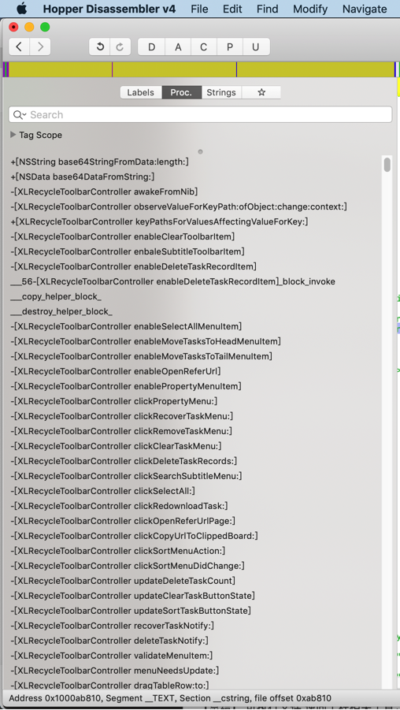
* Strings
  * 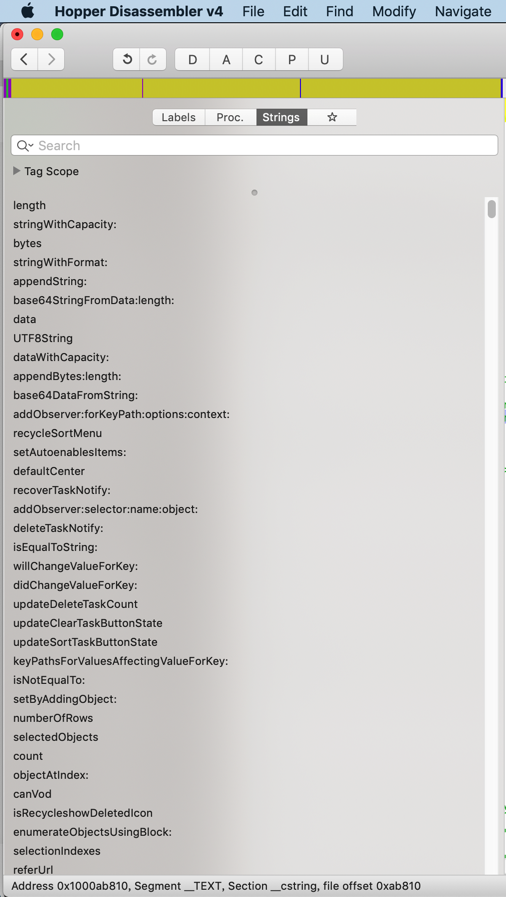

去看看app截图：

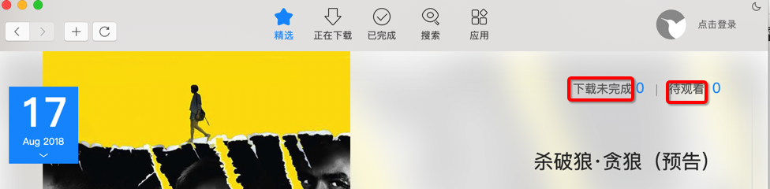

有下载未完成 待观看

或许能找到这些字符串？

当然如果加密了，是找不到的。

* 搜`下载`：搜不到。
* 搜`未完成`=`uncomplete`：搜到一些
  * 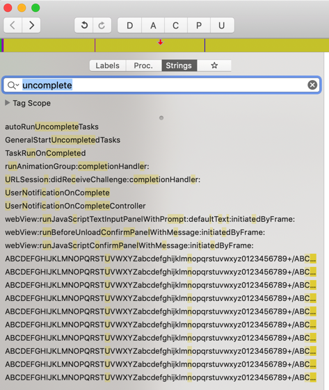

继续：

* 搜`vip`：还真能搜到些内容
  * 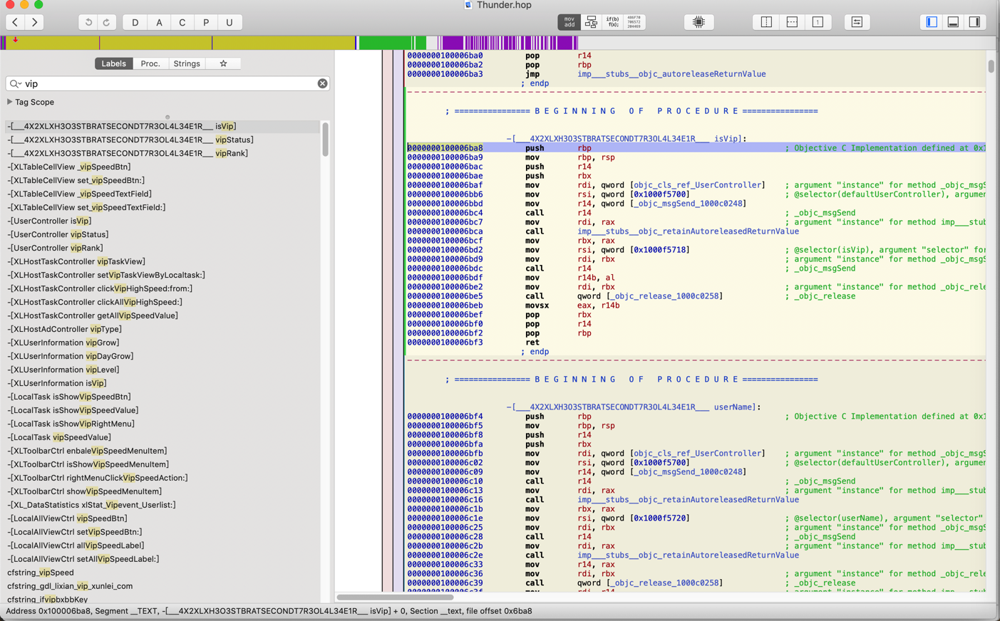

很明显有些是相关内容：

```c
isVip
vipStatus
vipRank

UserController isVip
UserController vipStatus
UserController vipRank
```

去看看：`伪代码`=`pseudo code`

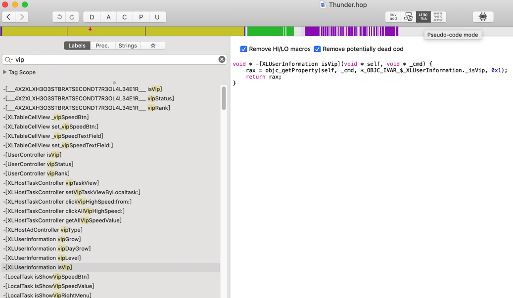

再去找找String中是否有我们要的重要的内容

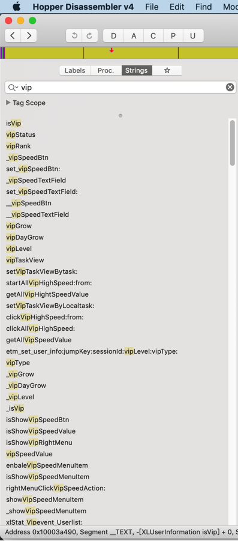

可以找到很多`isVip`相关的内容

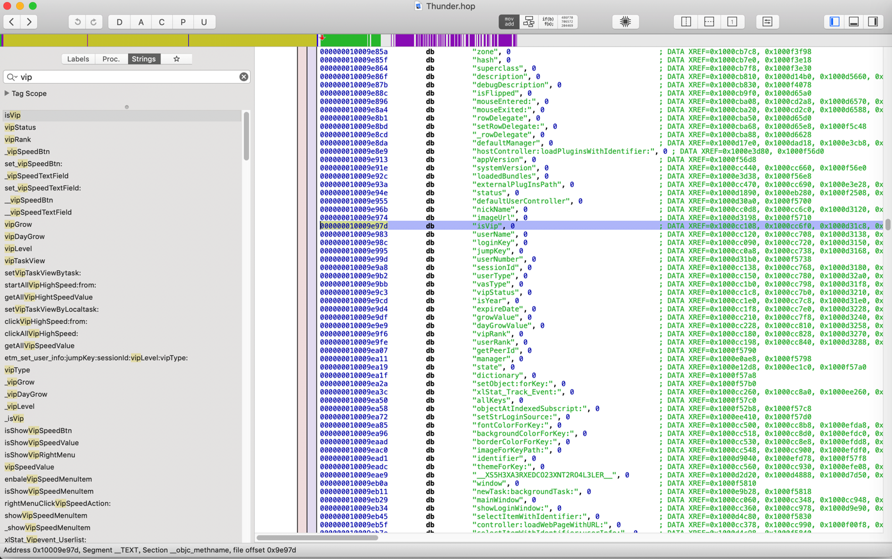

有点看起来是：和user用户相关的各种属性

```c
000000010009e96b         db         "nickName", 0                               ; DATA XREF=0x1000cc0d8, 0x1000cc6c0, 0x1000d3120, 0x1000de3b0, 0x1000f5708
000000010009e974         db         "imageUrl", 0                               ; DATA XREF=0x1000d3198, 0x1000f5710
000000010009e983         db         "userName", 0                               ; DATA XREF=0x1000cc120, 0x1000cc708, 0x1000d3138, 0x1000de380, 0x1000f5720
```

继续找被调用的地方：

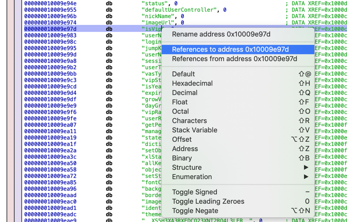

找到了几处：

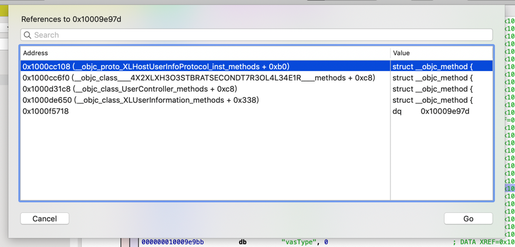

如此，根据需求，继续深入研究，即可慢慢分析出自己要找的逻辑。
