# Hopper打开Thunder迅雷

`Hopper Disassembler v4`->`File`->`Read Executable to Disassemble`:

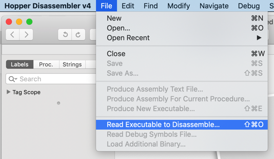

尝试去打开`Mac`的app：迅雷

`Thunder.app/Contents/MacOS/Thunder`

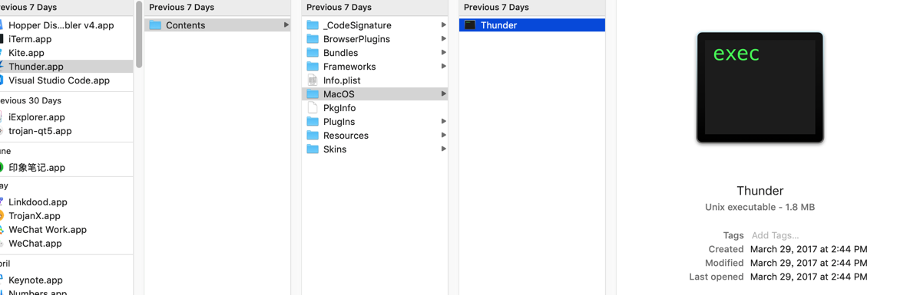

弹框显示加载选项：

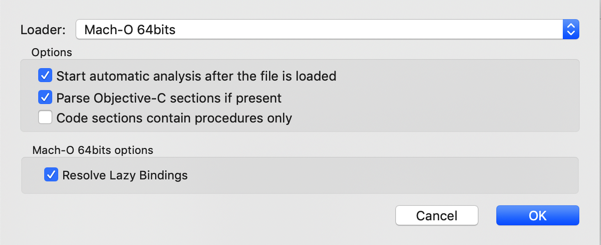

顺带看看Loader参数的其他可选性：

* 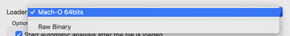
  * Loader可选项
    * `Mach-O  64bits`
    * `Raw Binary`

点击OK，即可加载分析：

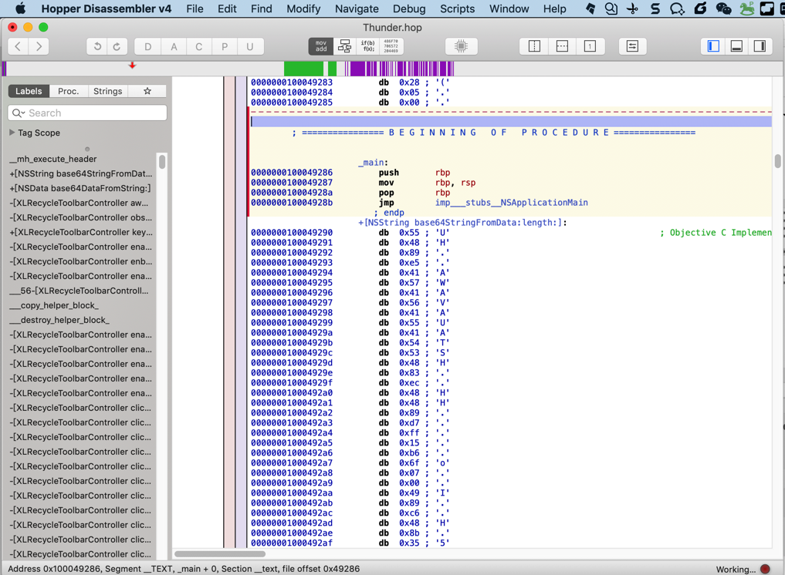

开始加载和分析。很快分析完毕，效果是：

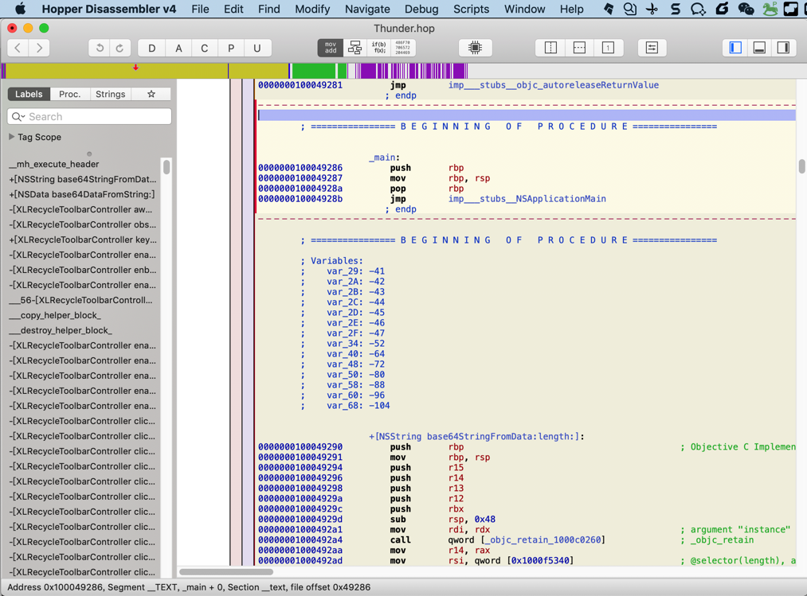

再去把右边和底部也开启显示：

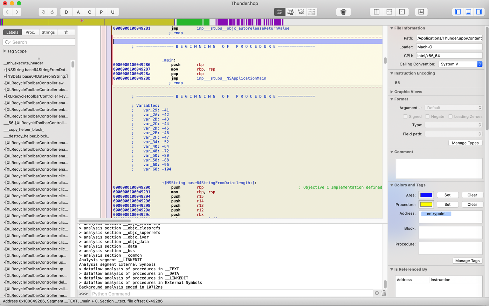

底部的log是：

```bash
Hopper is ready
Mach-O 64bits file loaded
Starting background analysis
Analysis segment __TEXT
> analysis section __text
> analysis section __stubs
> analysis section __stub_helper
> analysis section __gcc_except_tab
> analysis section __objc_methname
> transform section __objc_methname to C strings
> analysis section __cstring
> transform section __cstring to C strings
> analysis section __const
> analysis section __objc_classname
> transform section __objc_classname to C strings
> analysis section __objc_methtype
> transform section __objc_methtype to C strings
> analysis section __ustring
> analysis section __swift3_typeref
> analysis section __swift3_reflstr
> analysis section __swift3_fieldmd
> analysis section __swift3_assocty
> analysis section __swift2_types
> analysis section __swift2_proto
> analysis section __swift3_capture
> analysis section __unwind_info
> analysis section __eh_frame
Analysis segment __DATA
> analysis section __nl_symbol_ptr
> analysis section __got
> analysis section __la_symbol_ptr
> analysis section __const
> analysis section __cfstring
> analysis section __objc_classlist
> analysis section __objc_nlclslist
> analysis section __objc_catlist
> analysis section __objc_protolist
> analysis section __objc_imageinfo
> analysis section __objc_const
> analysis section __objc_selrefs
> analysis section __objc_protorefs
> analysis section __objc_classrefs
> analysis section __objc_superrefs
> analysis section __objc_ivar
> analysis section __objc_data
> analysis section __data
> analysis section __bss
> analysis section __common
Analysis segment __LINKEDIT
Analysis segment External Symbols
> mark procedures
Analysis segment __TEXT
> analysis section __text
> disassemble section __text
> searching additional procedures in section __text
> analysis section __stubs
> disassemble section __stubs
> searching additional procedures in section __stubs
> analysis section __stub_helper
> disassemble section __stub_helper
> searching additional procedures in section __stub_helper
> analysis section __gcc_except_tab
> analysis section __objc_methname
> analysis section __cstring
> analysis section __const
> analysis section __objc_classname
> analysis section __objc_methtype
> analysis section __ustring
> analysis section __swift3_typeref
> analysis section __swift3_reflstr
> analysis section __swift3_fieldmd
> analysis section __swift3_assocty
> analysis section __swift2_types
> analysis section __swift2_proto
> analysis section __swift3_capture
> analysis section __unwind_info
> analysis section __eh_frame
Analysis segment __DATA
> analysis section __nl_symbol_ptr
> analysis section __got
> analysis section __la_symbol_ptr
> analysis section __const
> analysis section __cfstring
> analysis section __objc_classlist
> analysis section __objc_nlclslist
> analysis section __objc_catlist
> analysis section __objc_protolist
> analysis section __objc_imageinfo
> analysis section __objc_const
> analysis section __objc_selrefs
> analysis section __objc_protorefs
> analysis section __objc_classrefs
> analysis section __objc_superrefs
> analysis section __objc_ivar
> analysis section __objc_data
> analysis section __data
> analysis section __bss
> analysis section __common
Analysis segment __LINKEDIT
Analysis segment External Symbols
> dataflow analysis of procedures in __TEXT
> dataflow analysis of procedures in __DATA
> dataflow analysis of procedures in __LINKEDIT
> dataflow analysis of procedures in External Symbols
Background analysis ended in 10712ms
```

显示的是加载和分析的过程。

看到有`__swift3_typeref`，或许表示此处Mac版Thunder是用Swift写的？

继续看看其他的：

* File Information
  * 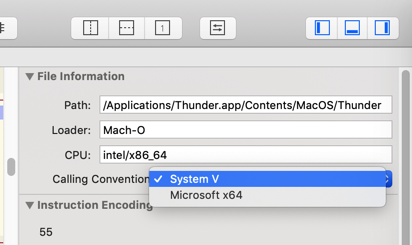
    * `Calling Convention`除了`System V`外还有`Microsoft x64`

中间部分解析出的内容：

```c
        ; ================ B E G I N N I N G   O F   P R O C E D U R E ================

        ; Variables:
        ;    var_29: -41
        ;    var_2A: -42
        ;    var_2B: -43
        ;    var_2C: -44
        ;    var_2D: -45
        ;    var_2E: -46
        ;    var_2F: -47
        ;    var_34: -52
        ;    var_40: -64
        ;    var_48: -72
        ;    var_50: -80
        ;    var_58: -88
        ;    var_60: -96
        ;    var_68: -104
```

从`Beginning of procedure`感觉是：main函数 入口处

看到了，上面就是`_main`：

```c
        ; ================ B E G I N N I N G   O F   P R O C E D U R E ================


                     _main:
0000000100049286        push      rbp
0000000100049287        mov        rbp, rsp
000000010004928a        pop        rbp
000000010004928b        jmp        imp___stubs__NSApplicationMain
```

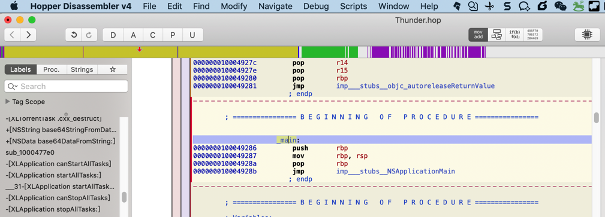

感觉是：Hopper自动帮我们定位到了main入口所在的位置

从`main`切换到`CTF mode`，结果显示的内容，很简单：

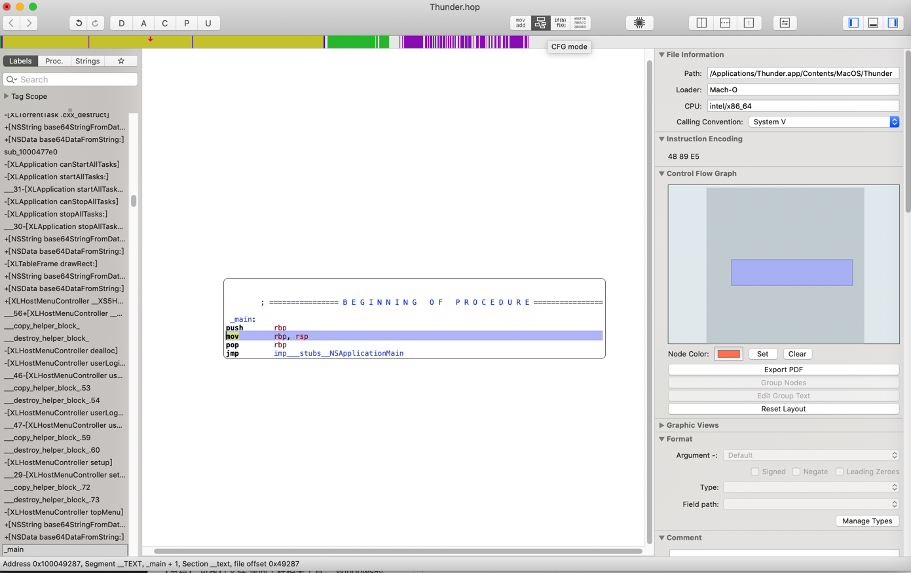

没有我希望的：函数调用顺序

不过后来搞懂了：是此处函数本身简单。

换个下面的函数代码段：

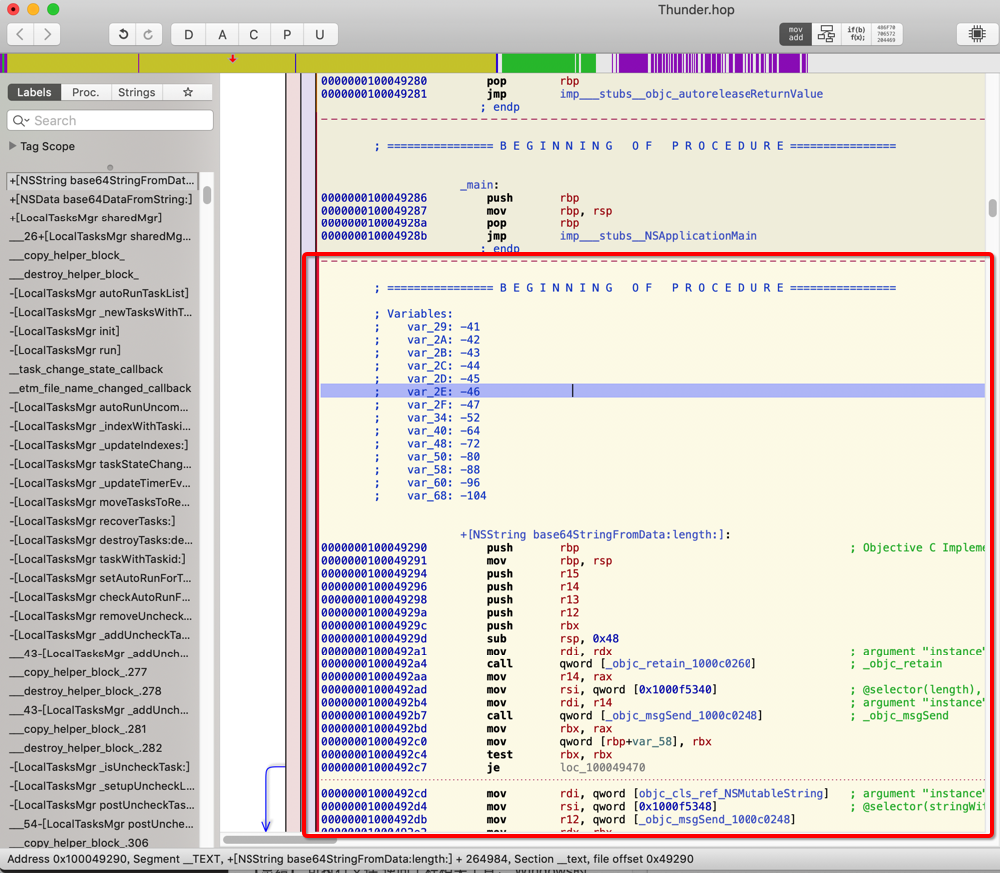

切换到`CTF mode`后，就可以看到希望看到的：调用关系了：

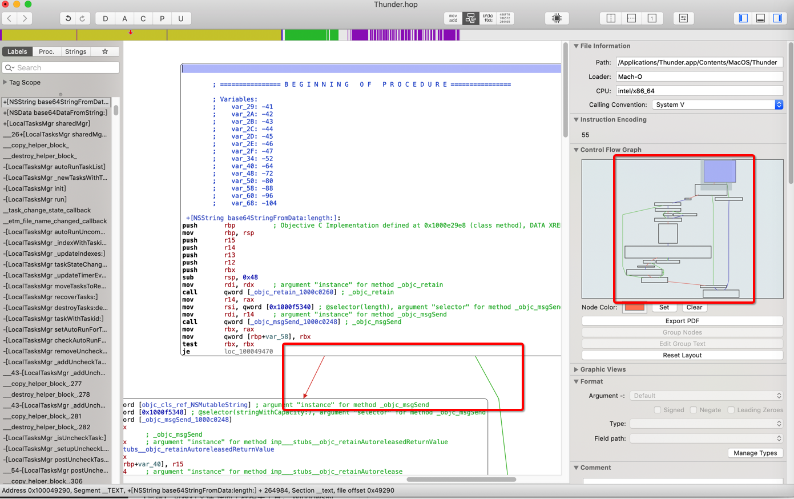

以及右边有`Control Flow Graph`=`控制流程图`了

移动后，随时可以看到占整体的比例和位置：

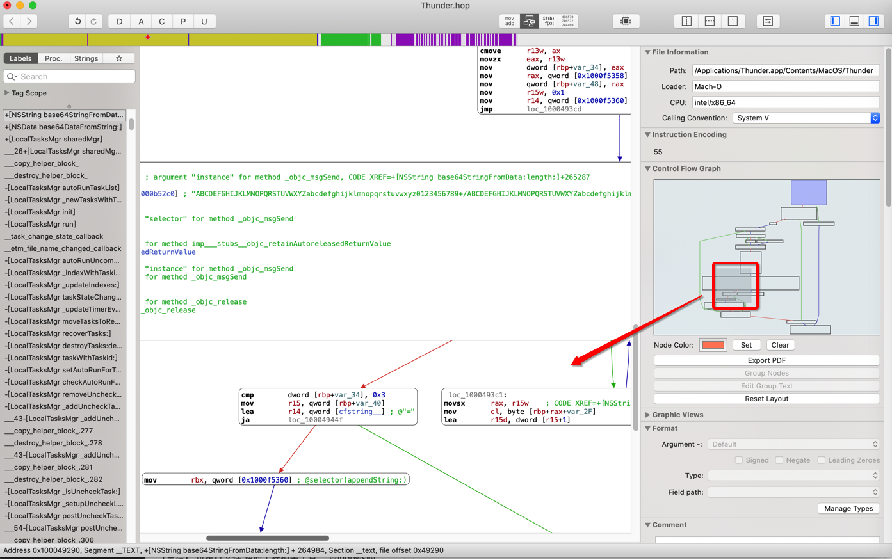

重点再去看看，找找，左边的：

* 函数列表
  * Labels
    * 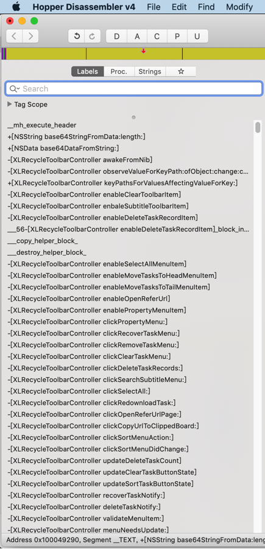
  * Proc
    * 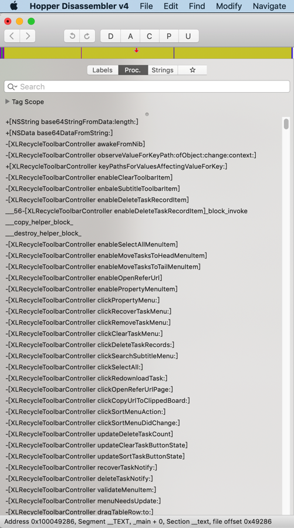
  * Strings
    * 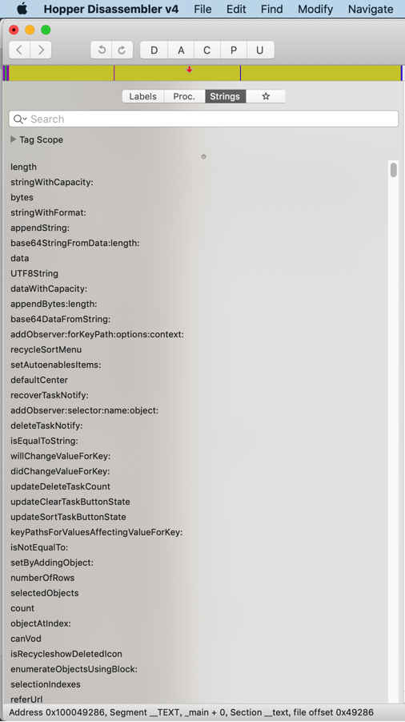

继续看看其他的：

点击`芯片图标`按钮，弹出`调试窗口`：

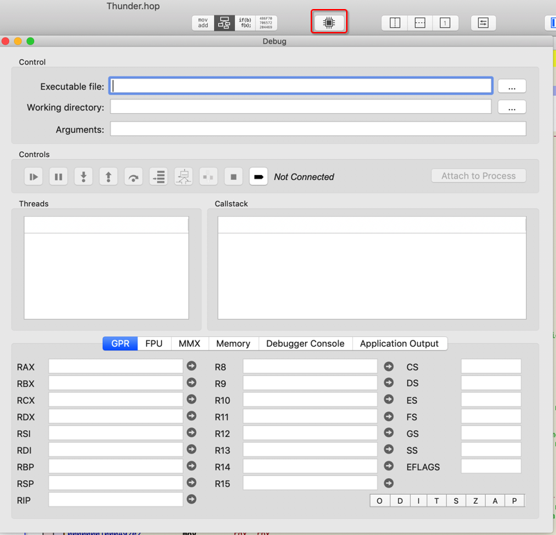
