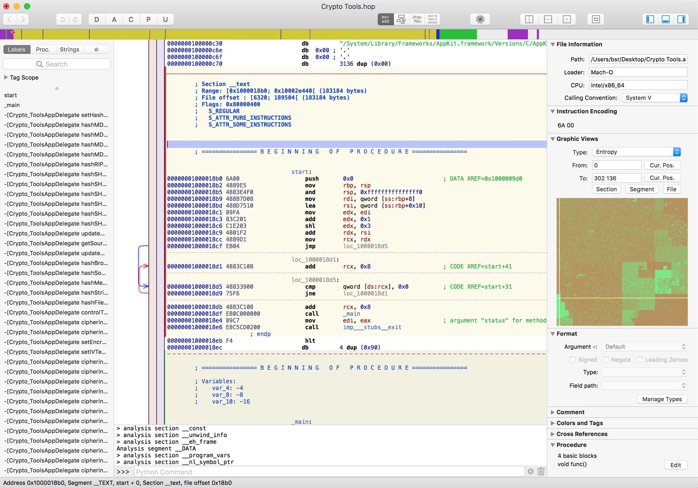
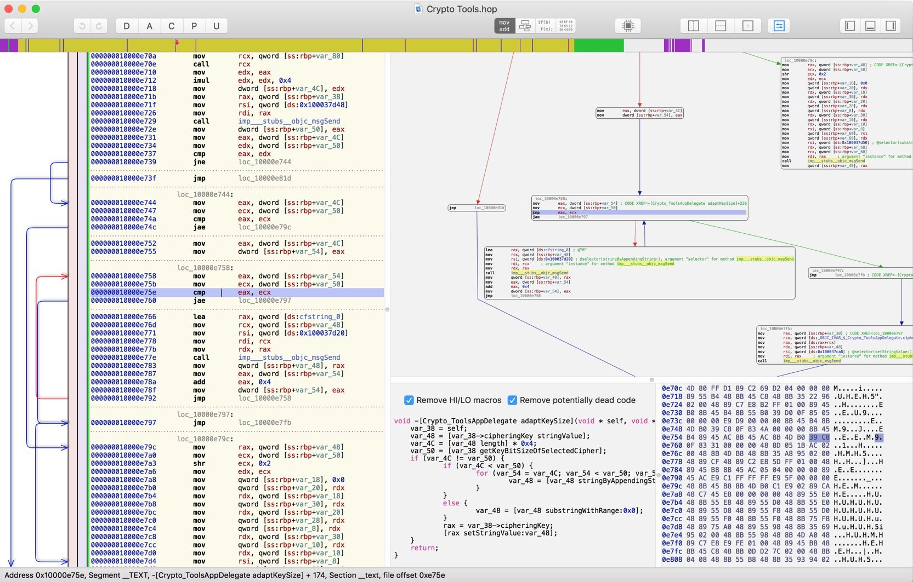
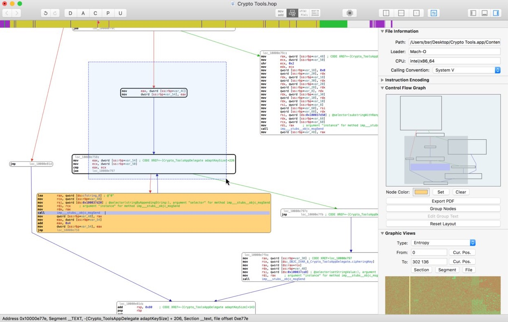
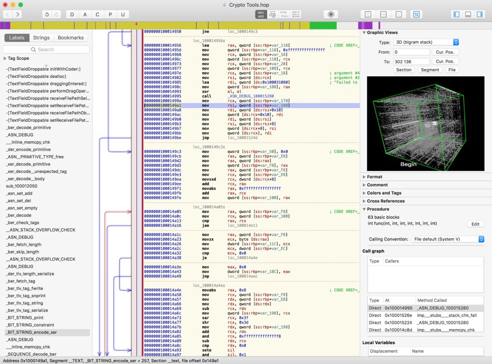

# Hopper概览

* `Hopper`=`Hopper Disassembler`
  * 偶尔缩写为：`hd`
  * 是什么：iOS逆向工具
    * Hopper is a reverse engineering tool for OS X and Linux, lets you disassemble, decompile and debug your applications
      * This tool will let you disassemble any binary you want, and provide you all the information about its content, like imported symbols, or the control flow graph! Hopper can retrieve procedural information about the disassembled code like the stack variables, and lets you name all the objects you want.
  * 作用：主要用于二进制的静态逆向分析代码逻辑
    * disassemble
    * decompile
  * 对标：IDA
  * 支持
    * 运行平台：`Mac`、`Linux`
    * 目标架构：`32/64bits Intel`/`Apple Silicon` Mac, Linux, Windows and iOS executables
  * 主页
    * [Hopper (hopperapp.com)](https://www.hopperapp.com/)
  * 截图
    * 
    * 
    * 
    * 

