# Hopper vs IDA

* Hopper vs IDA
  * 概述
    * `IDA`算**95分**，`Hopper`算**70分**
      * IDA比Hopper强大很多
  * 详解
    * 总体对比
      * 功能对比
        * IDA：更强大
          * 伪代码：逻辑更清晰
        * Hopper：功能简洁，基本够用
          * 伪代码：代码逻辑不够清晰
      * IDA和Hopper类比
        * Hopper：小工具箱
          * 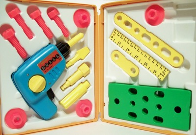
        * IDA：各种专业工具的工作室
          * 
    * 分项对比
      * 平台支持
        * Hopper：更倾向于`Mac`
        * IDA：支持多平台：`Windows`、`Linux`、`Mac`
      * 功能支持
        * 总体上还是IDA更强大，Hopper相对较弱
        * 不过据说部分细节方面，有些Hopper支持更好？
          * 比如
            * 中文字符搜索
              * IDA 7.0+：不支持
              * Hopper：支持
                * 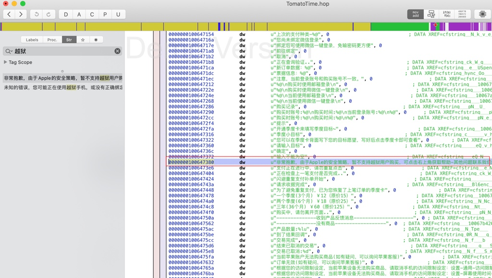
      * 价格
        * 正版IDA比Hopper贵**很多很多**
          * IDA Pro：**1000+**美元
          * Hopper：**~100**美元

## Hopper vs IDA：反编译代码对比

某同一段代码的反汇编效果对比：

* IDA
  * 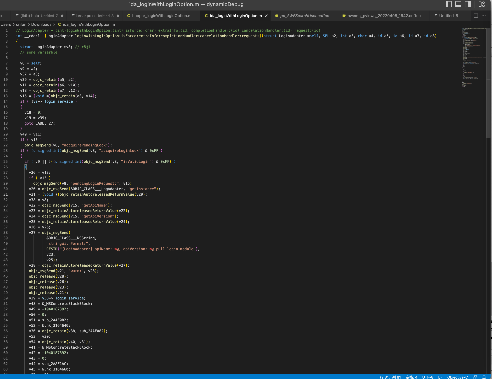
  * 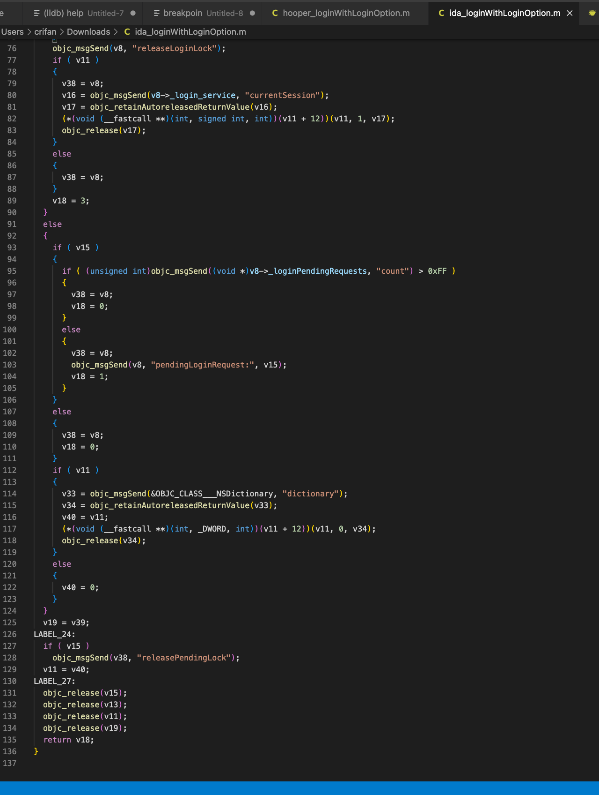
* Hopper
  * 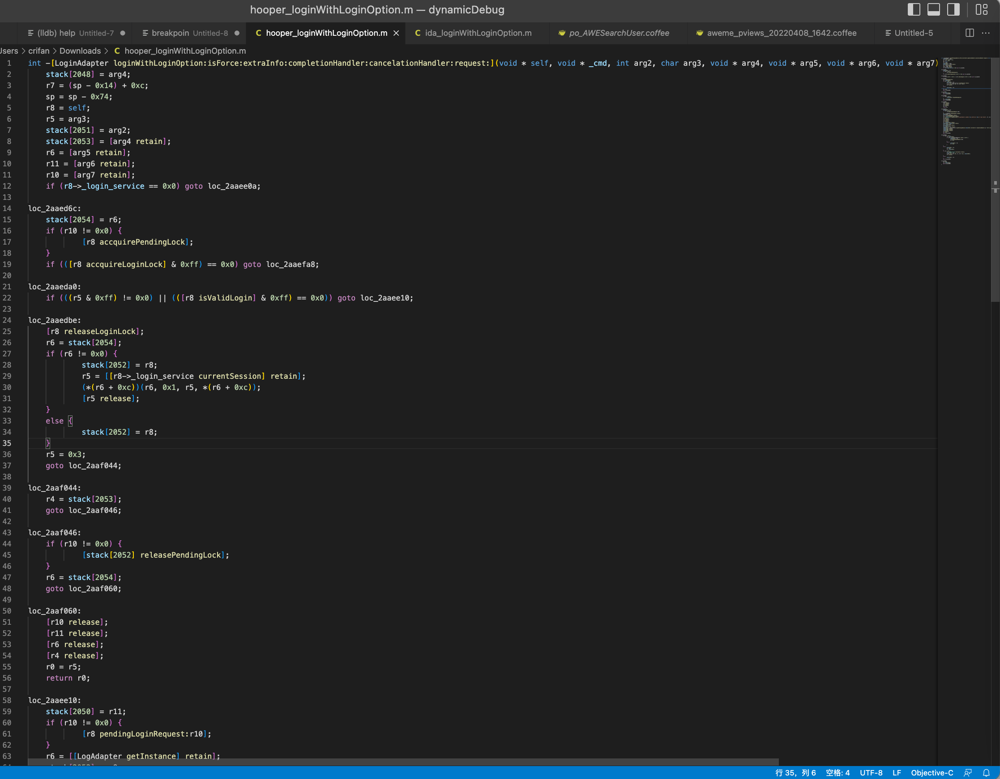
  * 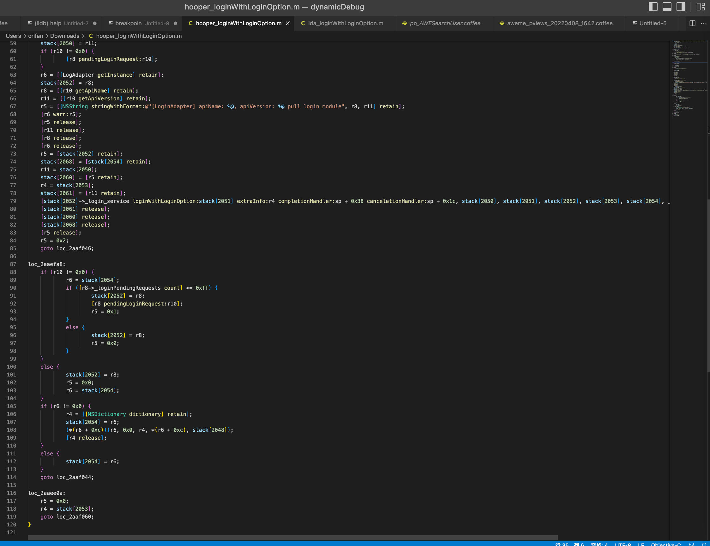

再用`BeyondCompare`详细对比：

* 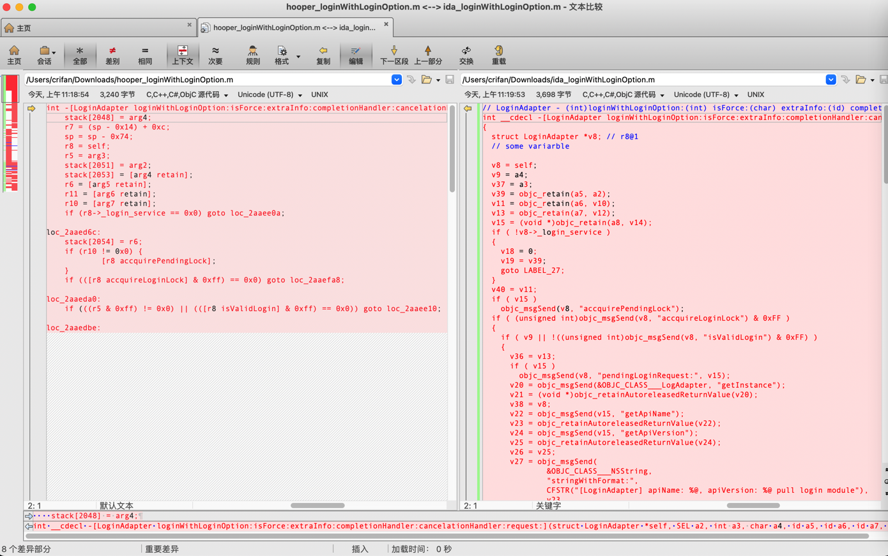
* 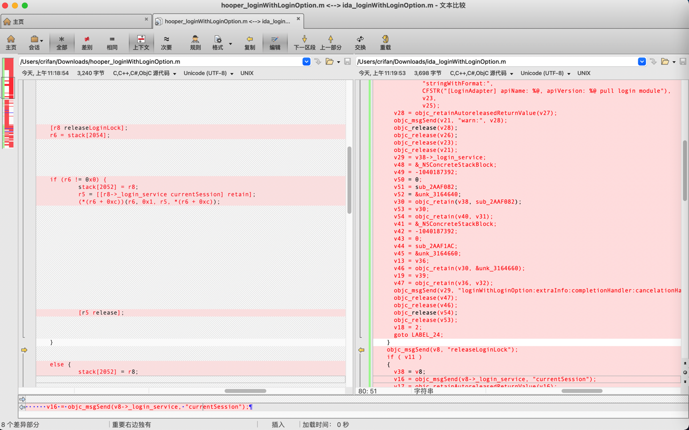
* 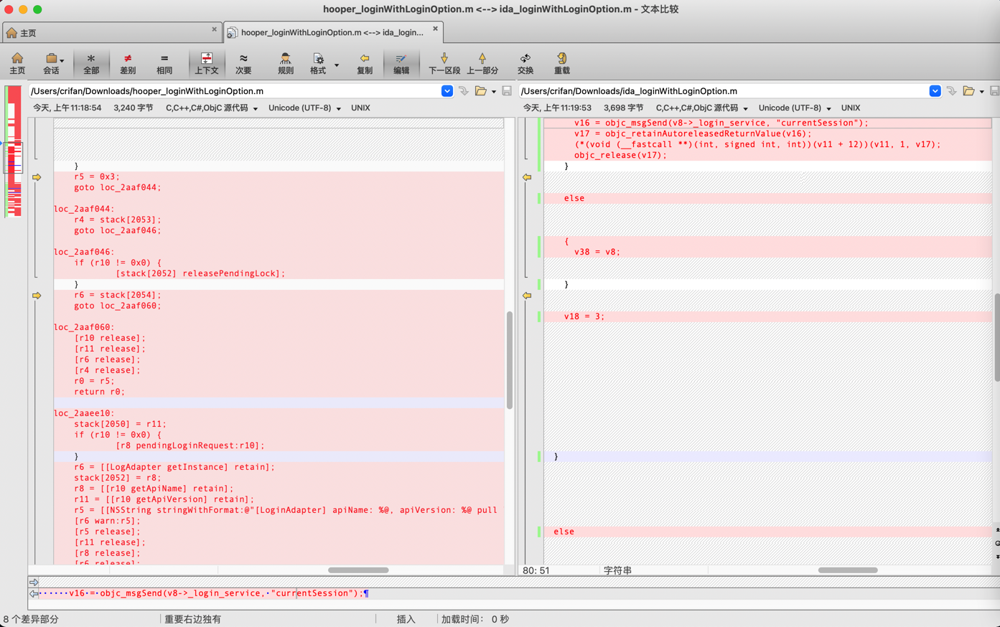
* 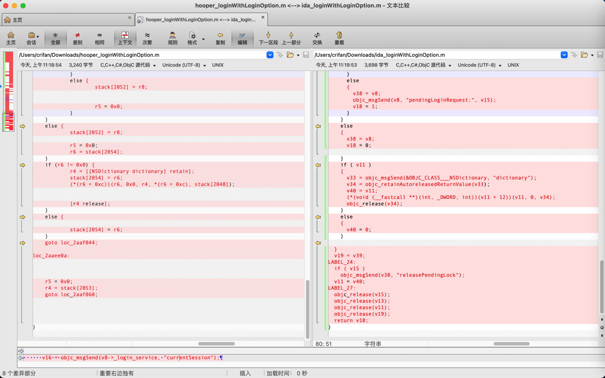

结论：

明显能发现，反编译后的伪代码的效果：

IDA更好，Hooper不够好

再具体的说说细节：

* Hopper的ObjC函数调用的写法做了优化，比IDA更易读
  * IDA
    ```c
    v22 = objc_msgSend(v15, "getApiName");
    v23 = objc_retainAutoreleasedReturnValue(v22);
    ```
  * Hopper
    ```c
    r8 = [[r10 getApiName] retain];
    ```
* 但是Hopper的核心代码调用逻辑，没有IDA清楚
  * IDA
    ```c
    int __cdecl -[LoginAdapter loginWithLoginOption:isForce:extraInfo:completionHandler:cancelationHandler:request:](struct LoginAdapter *self, SEL a2, int a3, char a4, id a5, id a6, id a7, id a8)
    ...
      if ( !v8->_login_service )
      {
        v18 = 0;
        v19 = v39;
        goto LABEL_27;
      }
    ...
    LABEL_27:
      objc_release(v15);
      objc_release(v13);
      objc_release(v11);
      objc_release(v19);
      return v18;
    }
    ```
  * Hopper
    ```c
    int -[LoginAdapter loginWithLoginOption:isForce:extraInfo:completionHandler:cancelationHandler:request:](void * self, void * _cmd, int arg2, char arg3, void * arg4, void * arg5, void * arg6, void * arg7) {
    ...
    loc_2aaf046:
        if (r10 != 0x0) {
                [stack[2052] releasePendingLock];
        }
        r6 = stack[2054];
        goto loc_2aaf060;

    loc_2aaf060:
        [r10 release];
        [r11 release];
        [r6 release];
        [r4 release];
        r0 = r5;
        return r0;

    ...

    loc_2aaee0a:
        r5 = 0x0;
        r4 = stack[2053];
        goto loc_2aaf060;
    }
    ```

后记：

自己在给YouTube恢复符号表之后，发现：

IDA的函数调用，也已经自动为iOS的ObjC做了优化，比如：

* IDA

```c
void __cdecl -[MLHAMQueuePlayer setStatus:](MLHAMQueuePlayer *self, SEL a2, signed __int64 a3)
{
  signed __int64 v3; // x19
  MLHAMQueuePlayer *v4; // x21
  signed __int64 v5; // x20
  __int64 v6; // x0


  if ( self->_player )
  {
    v3 = a3;
    v4 = self;
    v5 = self->_playerStatus;
    self->_playerStatus = a3;
    if ( a3 != 7 )
    {
      if ( v5 != 1 || (unsigned __int64)(a3 - 2) >= 3 )
      {
        if ( a3 == 8 && self->_playerError )
        {
          -[MLHAMQueuePlayer failWithError:](self, "failWithError:");
LABEL_11:
          -[HAMEventCenter asyncBroadcastPlayerStatusChangeFromStatus:toStatus:](
            v4->_hamEventCenter,
            "asyncBroadcastPlayerStatusChangeFromStatus:toStatus:",
            v5,
            v3);
          return;
        }
      }
      else
      {
        -[MLHAMQueuePlayer setState:](self, "setState:", 2LL);
      }
      v6 = sub_F91AA8(v3);
      -[MLHAMQueuePlayer setState:](v4, "setState:", v6);
      -[MLHAMQueuePlayer updateForegroundAudioOnlyPlaybackState](v4, "updateForegroundAudioOnlyPlaybackState");
      goto LABEL_11;
    }
  }
}
```
  * 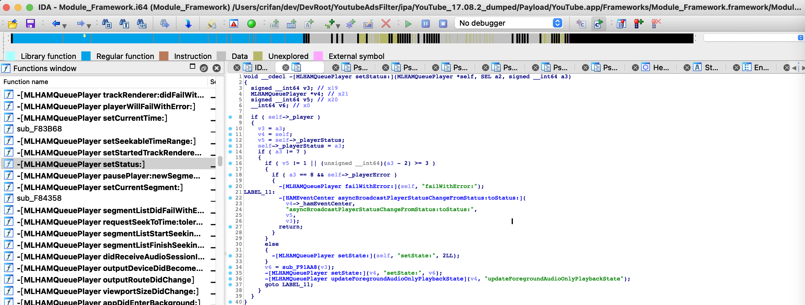

其中的：

```c
-[MLHAMQueuePlayer failWithError:](self, "failWithError:”);

-[HAMEventCenter asyncBroadcastPlayerStatusChangeFromStatus:toStatus:](
            v4->_hamEventCenter,
            "asyncBroadcastPlayerStatusChangeFromStatus:toStatus:",
            v5,
            v3);
```

等代码中ObjC函数调用的写法，已经优化为我们希望的效果了：

`[ObjcClass function](para1, para2)`

即：

IDA中其实也已支持ObjC函数调用的优化的写法了。
