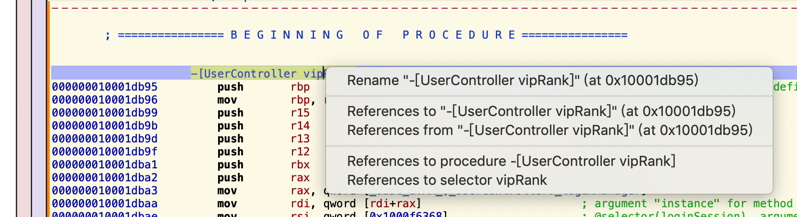

# Hopper心得

## Hopper导出伪代码

[poboke/Class-Decompile: Class Decompile is a python script for Hopper Disassembler. This script can export pseudo code of the classes. (github.com)](https://github.com/poboke/Class-Decompile)

据说可以导出Hopper的全部伪代码。有空去试试。

## 没有右键复制，直接快捷键复制

点击了函数，竟然没有直接双击选中并复制的功能

且右键也没有复制：

-》后来发现，其实没有双击和右键复制选择

-》当光标处于某行，直接Control+C就是复制整行内容

## 常见问题

### 卡死

Hopper打开太大的二进制，比如：

* YouTube的`Module_Framework`
* Aweme的`AwemeCore`

经常直接卡死，无法正常打开

-》导致无法正常使用。
